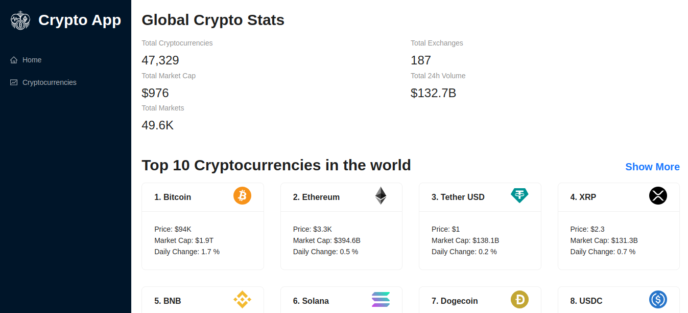
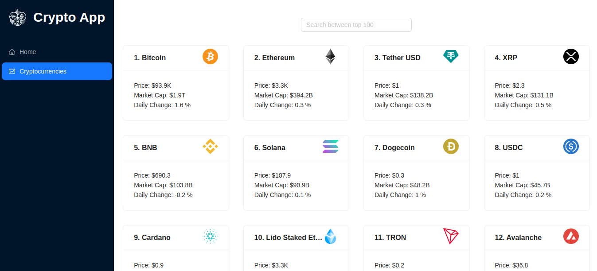
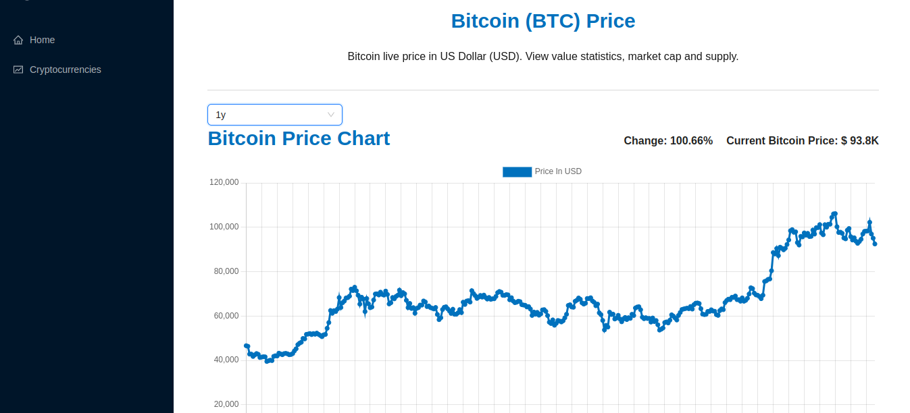

# Crypto App

**Crypto App** is a web application that provides real-time information about various cryptocurrencies. The app fetches data from the **Coinranking API** via **RapidAPI** and displays details like price, market cap, volume, and historical data for each cryptocurrency.

## Features

- **Real-time Cryptocurrency Data:** Fetches and displays up-to-date data of cryptocurrencies using the Coinranking API.
- **Cryptocurrency Details:** View detailed statistics and historical data charts for individual cryptocurrencies.
- **Global Crypto Stats:** Overview of total cryptocurrencies, total exchanges, market cap, volume, and more.
- **Responsive UI:** User-friendly and responsive design using Ant Design (AntD) components for styling.
- **Search Functionality:** Search for specific cryptocurrencies within the list.
- **Line Chart:** Displays historical price data using a line chart for better visualization.

## Technology Stack

- **React**: Frontend library for building user interfaces.
- **Redux Toolkit**: For state management, providing an efficient and structured way to manage the application state.
- **Redux Toolkit Query**: For data fetching, managing server-side requests.
- **React Router**: For navigation and routing between different pages.
- **Ant Design**: A UI library for adding stylish and responsive components.
- **Chart.js**: For rendering historical data charts.
- **RapidAPI**: For API access, specifically the Coinranking API, to retrieve the cryptocurrency data.

## Getting Started

### Prerequisites

- Node.js (version 20 or above)
- npm (Node Package Manager)

### Installation

1. Clone the repository and navigate to the project directory:

2. Install the dependencies:

   ```bash
   npm install
   ```

3. Create a `.env` file in the root directory and set your RapidAPI key:

   ```plaintext
   REACT_APP_CRYPTO_RAPIDAPI_KEY=your-rapidapi-key
   ```
   **Note**: You can obtain your RapidAPI key for the Coinranking API from [RapidAPI](https://rapidapi.com/Coinranking/api/coinranking1).

4. Start the development server:

   ```bash
   npm run dev
   ```

5. Open your browser and navigate to `http://localhost:3000` to see the application in action.

## File Structure

- `App.jsx`: Main component that sets up routes and contains global layout elements such as Navbar and Footer.
- `main.jsx`: Initializes the root render, wraps the app with the Redux provider and the React Router.
- `store/index.js`: Defines the Redux store and integrates the crypto API slice.
- `services/cryptoApi.js`: Contains API configurations and query endpoints for fetching cryptocurrency data.
- Components:
  - `Navbar.jsx`: Responsive navigation bar component.
  - `Homepage.jsx`: Component that displays the global crypto stats and the top 10 cryptocurrencies.
  - `Cryptocurrencies.jsx`: Component for listing all cryptocurrencies with search functionality.
  - `CryptoDetails.jsx`: Component for displaying detailed information and statistics of a specific cryptocurrency.
  - `LineChart.jsx`: Component for rendering historical price data of a cryptocurrency in a line chart.

## Screenshots

### Homepage


### Cryptocurrencies


### Crypto Details


## License

This project is licensed under the MIT License. See the [LICENSE](LICENSE) file for more details.
